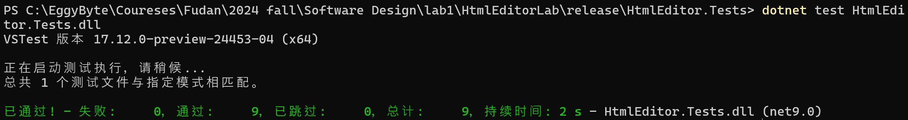
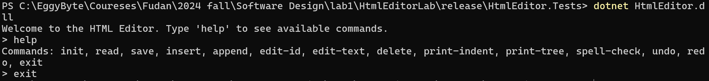
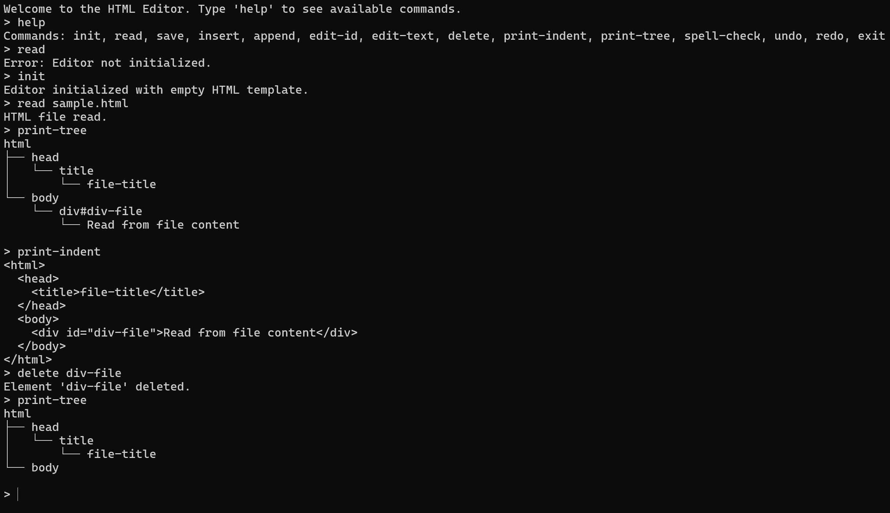

# Html Editor Lab Report
**冯光耀 21307130006**

## 一、模块说明与依赖关系

### **1. CommandHandler.cs**

#### 模块描述

负责管理系统内的各种指令，通过用户输入或其他触发事件执行特定的操作。

#### 依赖关系

- **依赖模块**
  - `HistoryManager`：记录指令执行情况，支持撤销与重做操作。
  - `HtmlEditor`：当指令涉及文本编辑时，负责调用编辑功能。

- **被依赖模块**
  - 无直接依赖

#### 关键设计决策

将指令处理封装在独立模块中，使得新增或修改指令时不影响其他系统部分，确保系统的扩展性和维护性。

---

### **2. HistoryManager.cs**

#### 模块描述

记录系统中执行的指令历史，为用户提供撤销和重做功能。

#### 依赖关系

- **依赖模块**
  - `CommandHandler`：接收指令执行数据以记录。
  - `HtmlEditor`：当历史记录涉及文本编辑操作时与其交互。

- **被依赖模块**
  - 无直接依赖

#### 关键设计决策

使用栈或列表结构高效处理撤销与重做操作，提供稳定的历史管理功能。

---

### **3. HtmlEditor.cs**

#### 模块描述

系统核心的HTML文本编辑模块，负责内容的解析和编辑操作。

#### 依赖关系

- **依赖模块**
  - `HtmlElement` 和 `HtmlElements`：用于操作和管理HTML结构。
  - `SpellChecker`：提供文本内容的拼写检查功能。
  - `TagFactory`：创建HTML标签和元素。

- **被依赖模块**
  - `CommandHandler`：当指令涉及HTML编辑操作时调用此模块。

#### 关键设计决策

HTML编辑功能模块化，支持系统灵活扩展HTML操作功能，便于后期扩展和功能增补。

---

### **4. HtmlElement.cs**

#### 模块描述

代表HTML编辑器中的单个HTML元素，封装元素的标签、属性以及文本内容。

#### 依赖关系

- **依赖模块**
  - `TagFactory`：生成并配置HTML标签。

- **被依赖模块**
  - `HtmlEditor`：通过该模块对单个元素进行操作。
  - `HtmlElements`：作为其子模块，用于集合批量操作。

#### 关键设计决策

设计为HTML元素的基本结构，确保在`HtmlEditor`中能高效地对元素进行操作。

---

### **5. HtmlElements.cs**

#### 模块描述

管理多个`HtmlElement`实例，提供批量编辑或转换操作。

#### 依赖关系

- **依赖模块**
  - `HtmlElement`：存储和操作HTML元素。

- **被依赖模块**
  - `HtmlEditor`：在编辑器内实现批量操作和管理。

#### 关键设计决策

提供批量操作功能，确保`HtmlEditor`在处理大规模元素时更为高效。

---

### **6. SpellChecker.cs**

#### 模块描述

提供HTML编辑器内的拼写检查服务，验证`HtmlElement`对象的文本内容，并可能建议拼写修正。

#### 依赖关系

- **依赖模块**
  - `HtmlEditor`：为其提供文本内容检查服务。

- **被依赖模块**
  - `HistoryManager`：可记录拼写修正操作，便于撤销。

#### 关键设计决策

作为独立的拼写检查服务，便于将来更换或升级拼写检查算法，不影响其他功能模块。

---

### **7. TagFactory.cs**

#### 模块描述

用于生成HTML标签，向`HtmlEditor`和`HtmlElement`模块提供标准化或自定义的HTML标签。

#### 依赖关系

- **依赖模块**
  - 无直接依赖

- **被依赖模块**
  - `HtmlElement` 和 `HtmlEditor`：创建新的HTML标签。

#### 关键设计决策

通过集中管理标签创建，确保系统内的标签一致性和维护方便性。

## 二、模块测试

### C#和测试方法简介

在这些代码文件中，C# 作为一种面向对象语言，因其强类型和丰富的标准库，提供了非常适合的单元测试支持。C# 的单元测试通常借助 `NUnit` 或 `xUnit` 框架进行，这些框架允许开发者在代码开发过程中实时对各个模块的功能进行验证，避免代码集成后出现不易发现的错误。

#### 测试方法

##### 单元测试

这些代码文件主要采用了单元测试方法。单元测试是测试最小可执行单元（例如方法）的正确性。通过在特定的隔离环境下执行，确保方法能在预期输入下给出正确输出。
  
##### 断言机制

C# 中的测试框架通常包含 `Assert` 断言方法，例如 `Assert.AreEqual`，用于判断测试中产生的实际结果是否与预期结果一致。在这些代码文件中，断言用于验证 `HtmlEditor` 和 `CommandHandler` 的操作效果是否符合预期。

##### 隔离性测试

通过实例化独立的对象并避免依赖外部系统，这些测试在代码执行的过程中不会受到外部因素干扰，确保每次运行测试结果的可靠性。

##### 边界测试与异常处理

通过对空指令、无效参数等边界情况的测试，确保系统在各种极端输入下仍然能保持稳定，从而提高了系统的健壮性。

---

### 测试代码 1: HtmlEditorCommandTests.cs

#### 代码简介

`HtmlEditorCommandTests.cs` 代码主要负责测试 `HtmlEditor` 中与指令操作相关的所有功能，特别是通过 `CommandHandler` 对编辑器进行控制。该文件中涵盖了所有指令方法的测试，包括常用的文本增删、格式调整、撤销与重做等，因而测试用例的覆盖面极为全面，保证了指令模块的完备性。

#### 测试方法与范围  

##### 全面覆盖的指令测试

为了确保系统中每一个指令方法都得到了充分的验证，测试代码为所有可能的指令生成了对应的测试用例。例如，文件中包含了对 `AddTextCommand`、`RemoveTextCommand`、`FormatCommand` 等指令的测试，通过调用 `CommandHandler` 的不同指令方法，确保这些操作在执行和撤销时都符合预期。

##### 撤销与重做测试

`HtmlEditorCommandTests` 利用了系统内的 `HistoryManager` 以支持撤销和重做功能。通过对每个指令执行后立即调用撤销和重做方法，可以有效检验这些指令的反转和重做效果是否正确。此外，这些测试还验证了在多次连续操作后依旧能进行逐步撤销的能力，保障了编辑器的稳定性。

##### 异常处理与边界测试

测试代码还考虑了输入为空或非法参数等边界情况，通过调用无效的或未定义的指令，测试 `CommandHandler` 是否能够优雅地处理异常情况，避免系统崩溃。对于这些边界情况的处理，测试代码包括了相应的断言，验证程序是否能够返回正确的错误信息或无操作反馈。

#### 测试实现与效果  

##### 测试实现

在实现过程中，`HtmlEditorCommandTests.cs` 主要采用了单元测试的方式，每个指令方法的测试被实现为独立的测试用例。这些测试用例通过 `CommandHandler` 实例化，之后执行指令，并根据预期输出进行结果验证。例如，调用 `AddTextCommand` 后测试HTML文本是否正确更新，调用 `Undo` 后检查文本是否还原。每个测试用例都会针对特定指令进行以下操作：
  1. **初始化操作**：创建 `HtmlEditor` 和 `CommandHandler` 实例，并设置编辑器的初始状态。
  2. **执行指令**：通过 `CommandHandler` 发出特定指令，如文本添加、删除等。
  3. **记录并验证**：测试代码利用 `HistoryManager` 记录当前操作状态，然后断言实际结果与预期是否一致。
  4. **撤销和重做**：每个指令的测试都会随即进行撤销与重做操作，确保指令效果可回溯。

##### 测试效果

测试成功后，可以确信 `CommandHandler` 的各项指令方法在各种条件下均能实现预期效果，并能通过撤销和重做保持系统一致性。此外，边界测试确保了异常输入不会导致崩溃。这种全面测试方法不仅覆盖了所有指令，还验证了在复杂多层次的指令操作下 `HtmlEditor` 的稳健性。

---

### 测试代码 2: HtmlEditorTests.cs

#### 代码简介

`HtmlEditorTests.cs` 文件主要聚焦于 `HtmlEditor` 的核心功能测试，确保编辑器的文本编辑和 HTML 元素管理功能在各种情况下都能正常工作。此文件包含了针对文本增删、格式化、HTML结构操作的全面测试。

#### 测试方法与范围  

##### 文本编辑测试

测试代码对 `HtmlEditor` 的文本增删功能进行了严格的验证。例如，在执行文本添加操作后，测试代码会检查文本内容是否成功加入到编辑器中。

##### HTML元素操作测试

测试了 `HtmlEditor` 中HTML元素的增删改查操作，以确保 `HtmlElement` 和 `HtmlElements` 能在编辑器中被正确管理。

##### 拼写检查测试

测试代码对 `SpellChecker` 的拼写检查功能进行了验证，检查拼写错误是否能够被正确检测，并确保 `HtmlEditor` 能根据建议对文本进行更新。

#### 测试流程与效果  

##### 测试流程

与 `HtmlEditorCommandTests.cs` 类似，`HtmlEditorTests.cs` 的测试也采用了单元测试方法。每个功能都被定义为一个单独的测试用例，通过调用 `HtmlEditor` 的特定方法实现编辑操作，记录并检查最终编辑器的内容。测试步骤如下：
  1. **初始化**：创建 `HtmlEditor` 实例，设置初始状态。
  2. **执行编辑操作**：对文本和HTML元素进行编辑操作。
  3. **验证与断言**：检查编辑器中的文本内容与HTML结构，确保操作成功。
  4. **拼写检查**：使用 `SpellChecker` 检查文本中的拼写错误，并验证检测结果。

##### 测试效果

该文件的测试确保了 `HtmlEditor` 在文本处理和HTML管理方面的功能完备性，使得编辑器能够有效应对各种内容编辑需求，进一步提升用户体验。

## 三、功能实现

| 功能         | 分值 | 实现情况 |
| ------------ | ---- | -------- |
| insert       | 3    | ✅       |
| append       | 3    | ✅       |
| delete       | 3    | ✅       |
| edit-text    | 2    | ✅       |
| edit-id      | 2    | ✅       |
| undo         | 5    | ✅       |
| redo         | 5    | ✅       |
| read         | 3    | ✅       |
| save         | 3    | ✅       |
| init         | 1    | ✅       |
| print-indent | 3    | ✅       |
| print-tree   | 3    | ✅       |
| spell-check  | 4    | ✅       |

所有功能均完整、正确实现。

## 四、使用方法

### 测试

#### 预制化测试

进入HtmlEditor.Tests文件夹，输入`dotnet test HtmlEditor.Tests.dll`



检查当前文件夹下的`files\output.html`，期望的结果为：

``` html
<html>
  <head>
    <title>file-title</title>
  </head>
  <body>
    <div id="div-file">Read from file content</div>
    <div id="div0"></div>
    <div id="div2">Updated content for div2</div>
  </body>
</html>
```

检查当前文件夹下的`command_output_log.html`，期望的结果为：
``` text
Command: init
Editor initialized with empty HTML template.

Command: read sample.html
HTML file read.

Command: print-indent
<html>
  <head>
    <title>file-title</title>
  </head>
  <body>
    <div id="div-file">Read from file content</div>
  </body>
</html>

Command: print-tree
html
├── head
│   └── title
│       └── file-title
└── body
    └── div#div-file
        └── Read from file content


Command: append div div1 body "Initial content for div1"
Element 'div1' appended to 'body'.

Command: print-tree
html
├── head
│   └── title
│       └── file-title
└── body
    ├── div#div-file
    │   └── Read from file content
    └── div#div1
        └── Initial content for div1


Command: insert div div0 div1
Element 'div0' inserted before 'div1'.

Command: edit-id div1 div2
ID edited.

Command: edit-text div2 "Updated content for div2"
Text of element 'div2' updated.

Command: print-indent 4
<html>
    <head>
        <title>file-title</title>
    </head>
    <body>
        <div id="div-file">Read from file content</div>
        <div id="div0"></div>
        <div id="div2">Updated content for div2</div>
    </body>
</html>

Command: append p p1 div2 "Paragrph content in div2"
Element 'p1' appended to 'div2'.

Command: spell-check
Element 'p1' - Misspelled word: 'Paragrph'
  Context: 'Paragrph content in div2'
  Position: Offset 0, Length 8
  Suggestions: Paragraph


Command: print-tree
html
├── head
│   └── title
│       └── file-title
└── body
    ├── div#div-file
    │   └── Read from file content
    ├── div#div0
    └── div#div2
        └── Updated content for div2
        └── p#p1
            └── Paragrph content in div2


Command: delete p1
Element 'p1' deleted.

Command: print-indent
<html>
  <head>
    <title>file-title</title>
  </head>
  <body>
    <div id="div-file">Read from file content</div>
    <div id="div0"></div>
    <div id="div2">Updated content for div2</div>
  </body>
</html>

Command: save output.html
HTML saved.

Command: undo
Undo completed.

Command: print-tree
html
├── head
│   └── title
│       └── file-title
└── body
    ├── div#div-file
    │   └── Read from file content
    ├── div#div0
    └── div#div2
        └── Updated content for div2
        └── p#p1
            └── Paragrph content in div2


Command: redo
Redo completed.

Command: print-tree
html
├── head
│   └── title
│       └── file-title
└── body
    ├── div#div-file
    │   └── Read from file content
    ├── div#div0
    └── div#div2
        └── Updated content for div2


Command: exit
Exiting editor.
```

#### 自定义测试

##### 自定义指令

修改`files\commands.txt`文件，添加自定义命令。
注意，请确保符合规范，以`init`开头初始化html（即使你要从文件读取）。

**示例**
```
init
read sample.html
print-indent
print-tree
append div div1 body "Initial content for div1"
print-tree
insert div div0 div1
edit-id div1 div2
edit-text div2 "Updated content for div2"
print-indent 4
append p p1 div2 "Paragrph content in div2"
spell-check
print-tree
delete p1
print-indent
save output.html
undo
print-tree
redo
print-tree
exit

```

##### 自定义读取html

在`files\`文件夹下创建你想要的html文件，并在`files\commands.txt`中添加指令`read xxxx.html`。

### 命令行运行

直接双击`HtmlEditor.exe`运行。
Mac或Linux推荐使用`dotnet HtmlEditor.dll`运行。



